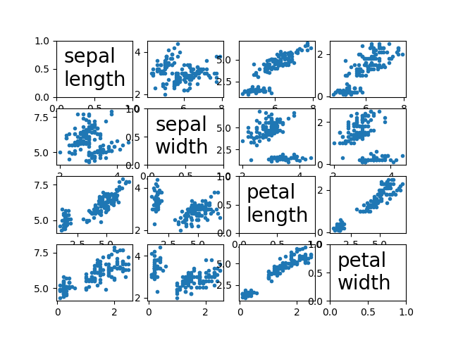
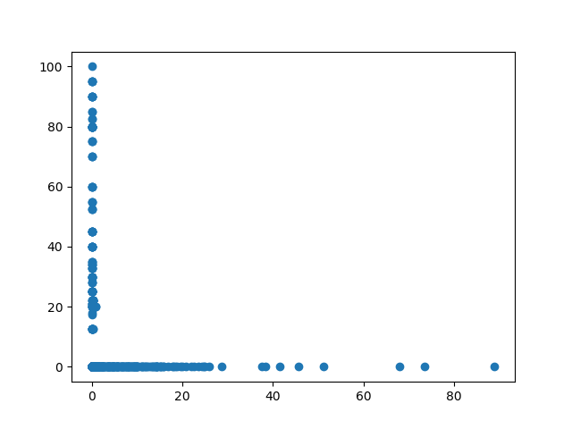

*201611353 荻野夏樹*

Rの以下の課題と同等のチュートリアルをPythonで実行した。
レポートは簡便なマークアップ言語Markdownで記述し、LaTeXにトランスパイルして作成した。

# 課題1-1
```R
library(MASS) # :: data() の中に iris がないとき実行する
iris
# 上記コマンドを実行して表示されるデータの、行ラベルと列ラベルを書き出し、その意味
# を示しなさい。データが多いので、適当に省略して説明すること。
```

## 回答
インタプリタで対話的に実行した結果をコメントで表している。
```python
from sklearn import datasets
iris = datasets.load_iris()
iris.keys()
#>> dict_keys(['data', 'target', 'filename', 'feature_names', 'DESCR', 'target_names'])
iris['data'].dtype
#dtype('float64')
iris['data'].shape #4つの特徴量で150件のデータ
#(150, 4)
iris['target'] #3品種に順に0,1,2とラベル付けられている
#array([0, 0, ..., 1, 1, ..., 2, 2, ...])
iris.feature_names
#['sepal length (cm)',
# 'sepal width (cm)',
# 'petal length (cm)',
# 'petal width (cm)']
```
150件のデータがSetosa, Versicolor, Virginicaの3品種に分類されており、それぞれ、Sepal Length（がく片の長さ）, Sepal Width（がく片の幅）, Petal Length（花びらの長さ）, Petal Width（花びらの幅）の4つの特徴量を持っていることが分かった。


# 課題1-2
iris データの各列のタイプとその意味を調べなさい。
## 回答
課題1-1の結果と被ってしまうが、irisは150行4列のデータで
行はデータ件数、列は特徴量を表している。

# 課題1-3
```R
c("a","b","c")[unclass(iris$Species)]
# を実行し、このコマンドの動作を説明しなさい。
```
## 回答
irisの3品種をそれぞれa,b,cと置き換えたリストを作っている。
pythonの場合はリスト内包表記と条件分岐の代わりに配列を使って以下のように書ける。
```
[['a', 'b', 'c'][k] for k in iris['target']]
```

# 課題1-4
```R
pairs(iris[1:4], pch=21, bg=c("red", "green3", "blue")[unclass(iris$Species)]
# を実行し、pch=21とbgの意味を調べなさい。
```

## 回答
同様の散布図をpythonで作る課題と解釈した。
点の大きさを小さくするためにscatter関数でmarker='.'と指定している。
また対角線上の図にfeature_namesを表示する際、
図の中心に適切な大きさで表示するためtext関数で位置やフォントなどを指定している。
得られた図とプログラムを以下に示す。


```python
from sklearn import datasets
import matplotlib.pyplot as plt
def kadai4():
    X, Y = 4, 4
    fig, ax = plt.subplots(X,Y)
    for x in range(X):
        for y in range(Y):
            x_name = iris.feature_names[x]
            y_name = iris.feature_names[y]
            if x == y:
                ax[x,y].text(0.1, 0.2, 
                             x_name.replace(' (cm)', '').replace(' ', '\n'),
                             fontsize=20)
            else:
                ax[x,y].scatter(iris['data'][:,x], iris['data'][:,y], marker='.')
    fig.savefig('out.png')
```

# 課題1-5
```R
data() #コマンドでiris以外のデータを一つ探し、散布図を作成し、
#利用したデータや属性について説明しなさい。
```
## 回答
```python
from sklearn import datasets
#米国ボストン市郊外における地域別の住宅価格のデータセット。
boston = datasets.load_boston()
boston.target # 目的変数 (1,000 ドル台でオーナーが所有する住宅の価格の中央値)
#array([ 24. ,  21.6,  34.7,  33.4,  36.2,  28.7,  22.9,  27.1,  16.5, ...
#特徴量の名前
boston.feature_names
#array(['CRIM', 'ZN', 'INDUS', 'CHAS', 'NOX', 'RM', 'AGE', 'DIS', 'RAD',
#       'TAX', 'PTRATIO', 'B', 'LSTAT'], dtype='<U7')
print(boston.DESCR) #説明文
```
米国ボストン市郊外における地域別の住宅価格のデータセット。


|特徴量  |説明                                                           |
|--------|---------------------------------------------------------------|
|CRIM    |人口 1 人当たりの犯罪発生数                                    |
|ZN      |25,000 平方フィート以上の住居区画の占める割合                  |
|INDUS   |小売業以外の商業が占める面積の割合                             |
|CHAS    |チャールズ川によるダミー変数 (1: 川の周辺, 0: それ以外)        |
|NOX     |NOx の濃度                                                     |
|RM      |住居の平均部屋数                                               |
|AGE     |1940 年より前に建てられた物件の割合                            |
|DIS     |5 つのボストン市の雇用施設からの距離 (重み付け済)              |
|RAD     |環状高速道路へのアクセスしやすさ                               |
|TAX     |$10,000 ドルあたりの不動産税率の総計                           |
|PTRATIO |町毎の児童と教師の比率                                         |
|B       |町毎の黒人 (Bk) の比率を次の式で表したもの。 1000(Bk – 0.63)^2 |


散布図を作成するにあたり、12個も特徴量があるので、12x12=144個の散布図を
タイル状に並べるても見ずらいだけなので、今回はx軸CRIM、y軸ZNの散布図を作るに留めた。
```python
plt.scatter(boston.data[:,0], boston.data[:,1])
plt.savefig("boston.png")
```
得られた散布図を以下に示す。

